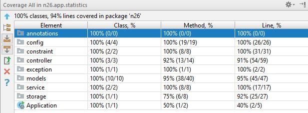
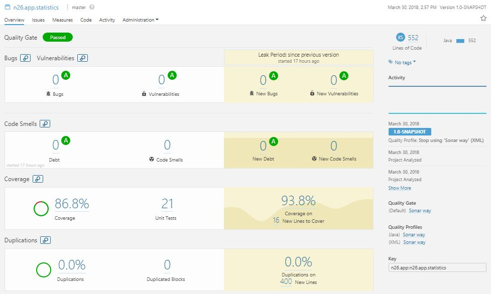

# [Question](QUESTION.md)
# Solution


## Technologies
### Language
*   Java 1.8
### Build Tool
*   Maven 3.5
### Frameworks Used
* Spring Boot 2.0.0.RELEASE
* Cucumber 1.2.5'

## Configurations available

### Configure time limit to store statistics
In application.yml add following entry 
```yaml
---
app:
  statistics:
    time:
      time-unit: seconds
      limit: 60
```
* **time-unit** represent unit of time to be used(*hours*|*seconds*|*minutes*|*milliseconds*)
* **limit** numeric value to specify duration
### Configure amount limit to store statistics
In application.yml add following entry
```yaml
---
app:
  statistics:
    transaction:
      lower-limit: 0
```
* **lower-limit** numeric value used to specify minimum value of amount in  transaction.

## API

### Transaction Endpoint

Request body validation prevents adding of transaction if amount is below *0* or timestamp expires (older than *60 seconds*)

```http
POST /transactions
```
### Request:
```http
POST /api/transactions HTTP/1.1
Content-Type: application/json;charset=UTF-8

{
    "amount": 12.3,
    "timestamp": 1478192204000
}
```
### Response
#### Success response sample
```http
HTTP/1.1 201 Created
```
#### Error response sample - timestamp is older than 60 seconds

```http
HTTP/1.1 204 No Content
```

Exposed by *app.statistics.n26.controller.TransactionController* controller.

### Statistics Endpoint
```http
GET /statistics
```
### Request:
```http
GET /api/statistics HTTP/1.1
Accept: application/json;charset=UTF-8
```

### Response
```http
HTTP/1.1 200 OK
Content-Type: application/json;charset=UTF-8

{
    "sum": 1330,
    "avg": 14,
    "max": 120,
    "min": 5,
    "count": 20
}
```

Exposed by *app.statistics.n26.controller.StatisticController* controller.

## Storage

Storing of statistics data is done by class *app.statistics.n26.storage.StatisticStore*. It internally uses *java.util.concurrent.ConcurrentHashMap* to store data.

## Test cases
#### To run all test cases please run:
~~~shell
mvn clean verify -P all-test
~~~

### JUnit Test cases
You can find unit test cases under package *app.statistics.n26.models* .
Test cases are written using JUnit to test functionality of methods in classes.

#### To run unit test cases please run:
~~~shell
mvn clean test
~~~
**Coverage Report:** target/coverage-reports/jacoco-ut.exec

**Surefire reports** target/surefire-reports 

**Coverage Html Report:** target/jacoco-ut/index.html

### Behavior-driven development Test cases
You can find *Behavior-driven development(BDD)* cases under package *bdd* and feature files under test resources

Cucumber is used to implement BDD
#### To run BDD test cases please run:
~~~shell
mvn clean verify -P integration-test
~~~
**Coverage Report:** target/coverage-reports/jacoco-ut.exec

**Failsafe reports** target/failsafe-reports

**Coverage Html Report:** target/site/jacoco-it/index.html

## Code Coverage

### Intellij Idea Code Coverage

[](screenshots/TestCoverage.JPG)

* Covered 100.0% classes
* Covered 94% lines

### Sonar Code coverage
[](screenshots/sonar_code_coverage.JPG)

* 86.8 Test coverage 
* Overall 21 unit test cases.
* Overall 34 BDD cases.
* **ZERO** bugs
* **ZERO** Vulnerablities
* **ZERO** Code smells
* **ZERO** Code duplication
# [Question](QUESTION.md)