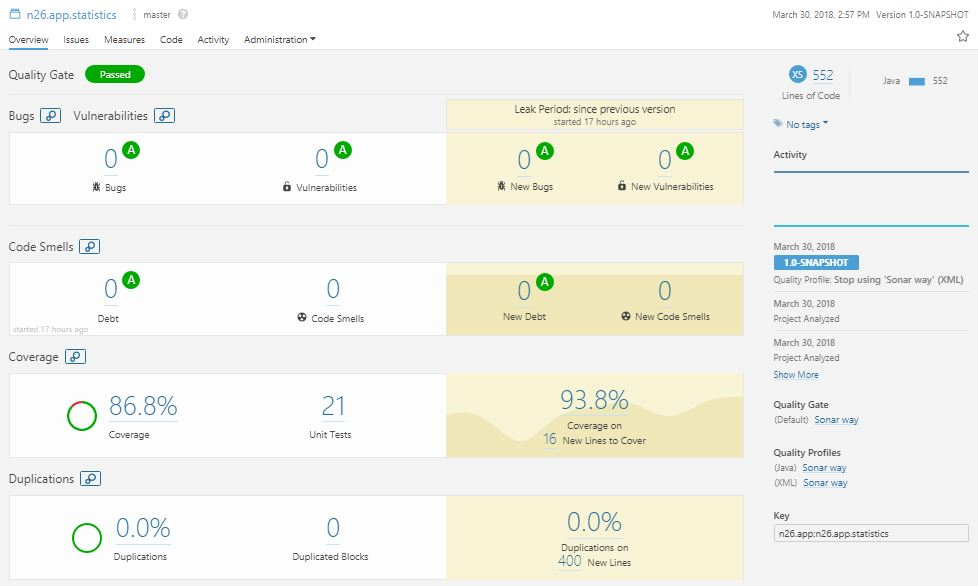

# Solution


## Technologies
### Language
*   Java 1.8
### Build Tool
*   Maven 3.5
### Frameworks Used
* Spring Boot 2.0.0.RELEASE
* Cucumber 1.2.5'

## Configuraions available

### Configure time limit to store statistics
In application.yml add following entry
```yaml
---
app:
  statistics:
    time:
      time-unit: seconds
      limit: 60
```
* *time-unit* represent unit of time to be used(*hours*|*seconds*|*minutes*|*milliseconds*)
* *limit* numeric value to specify durartion
### Configure amount limit to store statistics
In application.yml add following entry
```yaml
---
app:
  statistics:
    transaction:
      lower-limit: 0
```
* *lower-limit* numeric value used to specify minimum value of amount in  transaction.

## API

### Transaction Endpoint

Request body validation prevents adding of transaction if amount is below *0* or timestamp expired (older than *60 seconds*)

```http
POST /transactions
```
### Request:
```http
POST /api/transactions HTTP/1.1
Content-Type: application/json;charset=UTF-8

{
    "amount": 12.3,
    "timestamp": 1478192204000
}
```
### Response
#### Success response sample
```http
HTTP/1.1 201 Created
```
#### Error response sample - timestamp is older than 60 seconds

```http
HTTP/1.1 204 No Content
```

Exposed by *app.statistics.n26.controller.TransactionController* controller.

### Statistics Endpoint
```http
GET /statistics
```
### Request:
```http
GET /api/statistics HTTP/1.1
Accept: application/json;charset=UTF-8
```

### Response
```http
HTTP/1.1 200 OK
Content-Type: application/json;charset=UTF-8

{
    "sum": 1330,
    "avg": 14,
    "max": 120,
    "min": 5,
    "count": 20
}
```

Exposed by *app.statistics.n26.controller.StatisticController* controller.

## Storage

storing of statistics data is done by class *app.statistics.n26.storage.StatisticStore*. It internally uses *java.util.concurrent.ConcurrentHashMap* to store data.

## Test cases
### JUnit Test cases
You can find unit test cases under package *app.statistics.n26.models* 
Test cases are written using JUnit to test functionality of methods in classes

### Behavior Driven Test Cases Test cases
You can find *Behavior Driven Test(BDD)* cases under package *bdd* and feature files under test resources

Cucumber is used to implement BDD

### Code coverage
[](screenshots/TestCoverage.JPG)


## Sonar
### Sonar Code coverage
[](screenshots/sonar_code_coverage.JPG)

* 58.0 Test coverage (Spring configurarion classes and model classes are reason for low coverage percentage)
* Overall 45 test cases are their.
* 0 bugs
* 0 Vulnerablities
* 0 debt
* 0 Code smells
* 0% Code duplication
